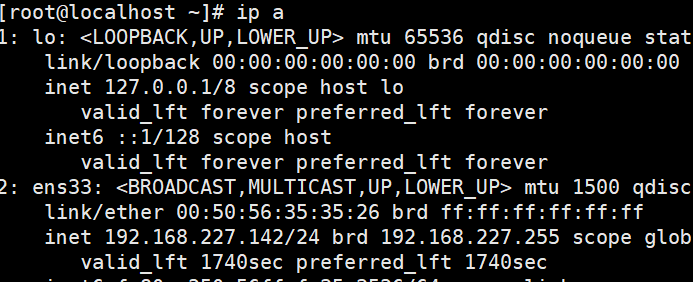
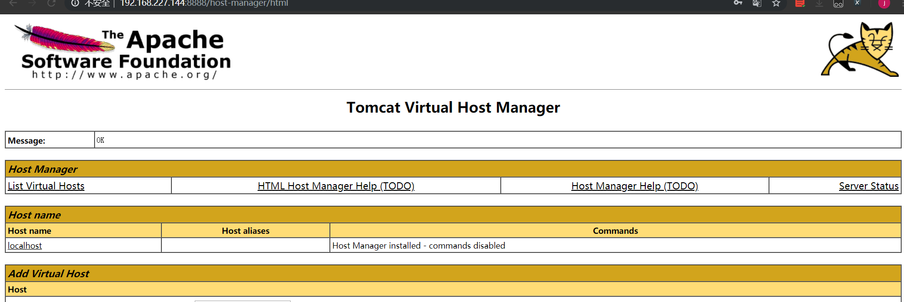

# 主要指令

  不会查文档：docker run --help     docker image --help 以此类推

​                         docker --help

```
查看docker详细信息    
                    docker info
查看docker版本       
                    docker ‐‐version/version(c/s  server：docker engine架构)
启动/停止/重启docker：
                    sudo systemctl start/stop/restart docker
Ubuntu：开机自动启动 
CentOS：手动启动      
                    systemctl enable docker（开机启动）
查看docker运行状态    
                    sudo sytemctl status docker
******************************************************************************
列出镜像（镜像都是存储在Docker宿主机的/var/lib/docker目录）      
                    docker images

查找镜像（stars：用户评价  auto commit：表该镜像由Docker Hub自动构建流程创建的 ）  
                    docker search 镜像名称

拉取镜像             docker pull 镜像名称[:version]
删除镜像              
                    删除一个   docker rmi 镜像名称/id
                    删除多个   docker rmi 镜像名称/id1 镜像名称/id2
                    删除全部   docker rmi `docker images -q`
                    
创建容器（‐i：交互式容器   ‐t：tty 终端    ‐d:后台运行，并且打印容器id）           
                    docker run ‐‐name=u1 ubuntu /bin/bash
                    docker run ‐i ‐t ‐‐name=u1 ubuntu /bin/bash 
                    docker run ‐i ‐t ‐d ‐‐name=u3 ubuntu /bin/bash
进入容器             
                    docker attach 容器名称/id    (ps:exit,容器停止) 
                    docker exec ‐it 容器名称/id /bin/bash（ps:exit,容器不会停止） 
查看容器 
                    docker ps：查看正在运行的容器 
                    docker ps ‐a：查看运行过的容器（历史） 
                    docker ps ‐l：最后一次运行的容器      
停止/启动容器         
                    docker start 容器名称/id 
                    docker stop 容器名称/id

获取容器/镜像的元数据
                    docker inspect 容器/镜像
                    docker inspect ‐f='{{.NetworkSettings.IPAddress}}' 
                    （容器/镜像 ‐f：可通过‐‐format代替）
删除容器
                    删除一个容器   docker rm 容器名称/id
                    删除多个容器   docker rm 容器名称1/id1 容器名称2/id2 ...
                    删除所有容器   docker rm `docker ps ‐a ‐q`
                    （PS：无法删除正在运行的容器）
查看容器日志
                    docker logs 容器名称/id

******************************************************************************
文件拷贝             
                    docker cp  1.txt c2:/root
                    docker cp c2:/root/2.txt /root 

目录挂载（将宿主机的目录与容器内的进行映射，这样我们就可通过修改宿主机某个目录的文件从而去影响容器）   
                    docker run ‐id ‐‐name=c4 ‐v /opt/:/usr/local/myhtml centos
                    
                    docker run ‐id ‐‐privileged=true ‐‐name=c4                                                                    ‐v /opt/:/usr/local/myhtml  centos
                   （共享的是多级目录，出现权限不足是CentOS7中的安全模块selinux把权限禁掉了，我                      们需加参数  -privileged=true  来解决挂载的目录没有权限）

******************************************************************************
镜像打包
                    docker save ‐o /root/tomcat7.tar mytomcat
镜像上传
                    scp tomcat7.tar 其他服务器ip:/root
镜像导入
                    docker load ‐i /root/tomcat7.tar 
容器打包  
                    docker export ‐o /root/t1.tar t1 
导入容器  
                    docker import t1.tar mytomcat:latest  
                    
```

# 安装和配置

> 安装与验证是否可用

```
官方文档（https://docs.docker.com/install/linux/docker-ce/centos/）
sh auto_docker_install.sh  
```

> 配置镜像加速器

```
‐ 阿里云配置镜像加速器
    第一种方式：（先加入阿里云开发者平台：https://dev.aliyun.com 登录》弹性计算的容器镜像服务》管理控制台》镜像加速器 参考该网站具体的文档操作）
    第二种方式： (直接复制下面到shell执行)   

sudo mkdir -p /etc/docker
sudo tee /etc/docker/daemon.json <<-'EOF'
{
  "registry-mirrors": ["https://5wjm672p.mirror.aliyuncs.com"]
}
EOF
sudo systemctl daemon-reload
sudo systemctl restart docker

验证：cat /etc/docker/daemon.json发现里面有阿里云的镜像地址

**********************************************************************
其他镜像加速器
‐ docker中国加速器（https://www.docker‐cn.com) 
‐ USTC加速器（https://lug.ustc.edu.cn/wiki/ ）  真正的公共服务（无需任何操作） 
‐ daocloud、网易蜂巢加速器等
```
> 制作tomcat镜像步骤（两种方式参考文档制作，或者用脚本）

```
第一种方式：

1、宿主机拉取一个基础镜像（其始就是OS） 
           docker pull centos
2、宿主机创建一个交互式容器 
           docker run ‐it ‐‐name=mycentos centos:latest
3、软件上传：将宿主机Tomact、jdk上传到容器中 
           docker cp apache‐tomcat‐7.0.47.tar.gz mycentos:/root/ 
           docker cp jdk‐8u161‐linux‐x64.tar.gz mycentos:/root/
4、在容器中安装jdk  （yum install java‐1.7.0‐openjdk） （https://pan.baidu.com/s/18QGn2Tc2kDNJVflqwfgghA可下载jdk‐8u161‐linux‐x64.tar.gz）
           tar ‐zxvf jdk‐8u161‐linux‐x64.tar.gz ‐C /usr/local/ 
编辑/etc/profile文件，添加如下内容： 
           JAVA_HOME=/usr/local/jdk1.8.0_161 
           export PATH=$JAVA_HOME/bin:$PATH
5、在容器中安装tomcat 
           tar ‐zxvf apache‐tomcat‐7.0.47.tar.gz ‐C /usr/local/ 
编辑vi /usr/local/apache-tomcat-7.0.47/bin/setclasspath.sh文件，添加如下内容： 
           export JAVA_HOME=/usr/local/jdk1.8.0_161 
           export JRE_HOME=/usr/local/jdk1.8.0_161/jre
6、宿主机上将正在运行的容器提交为一个新的镜像
           docker commit mycentos mytomcat
 
 
第二种方式：        
***************************************************************
或者使用我已经编写好自动脚本。只需四步
1.把docker文件夹的文件上传到宿主机上
2.在宿主机上运行，并输入 镜像名字
   sh autocreate_self_imges.sh
3.执行第二步后会自动进入创建好的镜像，只要再执行
   sh /root/create_tomcat_centos_images.sh
4.宿主机上将正在运行的容器提交为一个新的镜像
   exit
   docker commit 镜像名字 新的镜像名字
   
   查看是否有新的镜像名字：docker imgages
```

> 运行tomcat

```
docker端口映射
docker run ‐itd ‐‐name=t1 ‐p 8888:8080 mytomcat /bin/bash 

docker启动tomcat
docker exec t1 /usr/local/apache‐tomcat‐7.0.47/bin/startup.sh

通过主机（非虚拟机）访问：http://宿主机ip:port

```

虚拟机查看ip



win10的chrome浏览器访问


配置密码


能够清楚的看到，有三个可以访问的链接。点击时需要用户名和密码。现在无法访问。

- Server Status
- Manager App
- Host Manager

第二步：配置tomcat-users.xml 文件

在主目录的cong文件夹下找到tomcat-users.xml 文件中配置用户角色：

针对第三个按钮“Host Manager”，配置角色时一定把角色配全。修改tomcat-users.xml 文件，加入如下代码：

1. <role rolename="admin-gui"/>  
2. <role rolename="manager-gui"/>    
3. <user username="tomcat" password="s3cret" roles="admin-gui,manager-gui"/>  

配置tomcat-users.xml文件后，重新启动tomcat服务。在浏览器成功访问tomcat，点击要访问的 “Host Manager”在弹出的“身份验证”框中输入用户名：tomcat，密码：s3cret，点击登录按钮。效果如下：



